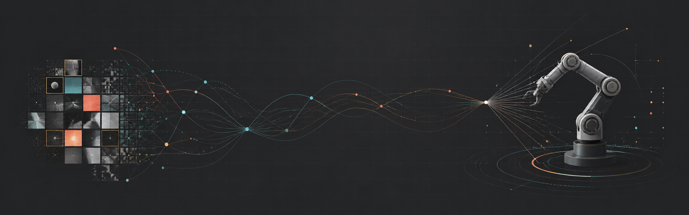
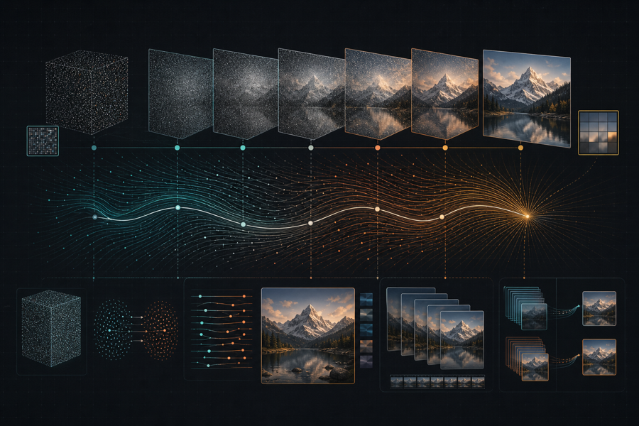
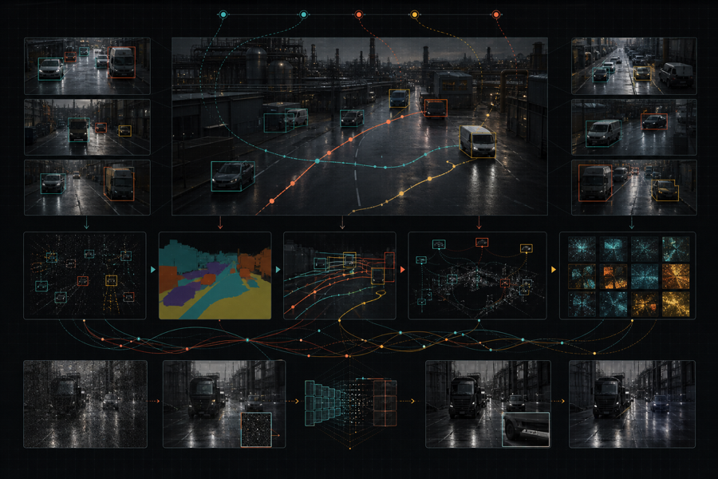
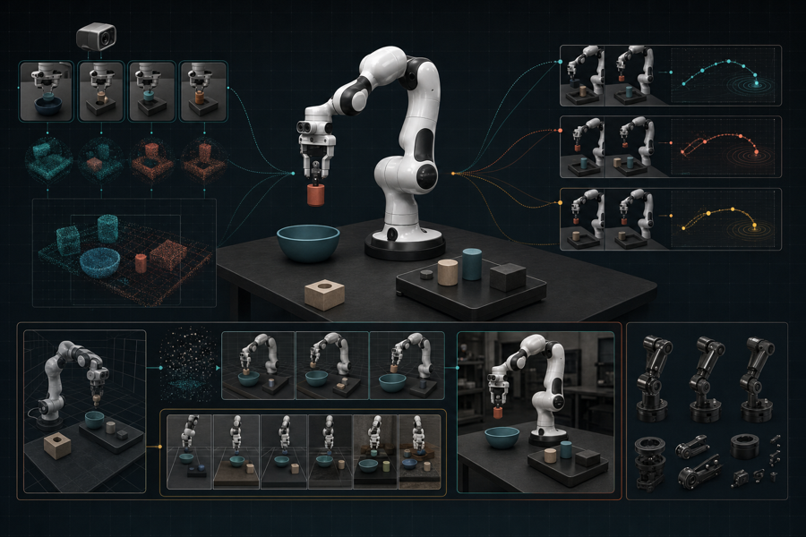

  

<h1 align="center">Tauhid Khan</h1>

  <strong>AI Research Engineer | Generative AI | Computer Vision | Robot Learning</strong>

  I build research-driven machine learning systems, from model design and large-scale training to efficient production deployment.

  
  
  
  

---

## 👋 About Me

> I build research-driven machine learning systems that move from **model design and distributed training** to **optimized production inference**.

I am an AI Research Engineer with 4+ years of experience across generative AI, computer vision, multimodal learning, and efficient inference. At Fynd, I develop image and video systems involving Flow Matching, diffusion models, super-resolution, model distillation, distributed PyTorch, and TensorRT.

Previously, at Wobot.ai, I built large-scale video analytics systems for detection, multi-object tracking, and cross-camera association. My current research connects generative vision with embodied intelligence: learning representations, trajectories, and policies that are accurate, efficient, and deployable.

  
  
  
  

## 🔬 Research And Engineering Focus

<table>
  <tr>
    <td width="33%" align="center" valign="top">
      
      <h3>✨ Generative Vision</h3>
      Flow Matching · Diffusion · Image and video generation · Super-resolution · One-step distillation
    </td>
    <td width="33%" align="center" valign="top">
      
      <h3>👁️ Computer Vision</h3>
      Detection · Segmentation · Multi-object tracking · Restoration · Production GPU inference
    </td>
    <td width="33%" align="center" valign="top">
      
      <h3>🤖 Robot Learning</h3>
      VLA · Visuomotor policies · Imitation learning · Reinforcement learning · Sim2Real
    </td>
  </tr>
</table>

## 📄 Publication

> ### 🧭 Isokinetic Flow Matching for Pathwise Straightening of Generative Flows
>
> **Accepted at the ICML 2026 Workshop on Structured Probabilistic Inference and Generative Modeling (SPIGM).**
>
> A geometry-aware Flow Matching formulation for straighter generative transport paths and more efficient generation.

  

## 💼 Experience

### 🧠 ML Research Engineer · Fynd

`Sep 2023 - Present` · Flow Matching super-resolution, single-step distillation, SDXL and FLUX training, video segmentation and inpainting, controllable generation, distributed PyTorch, and TensorRT deployment.

### 👁️ Computer Vision Engineer · Wobot.ai

`Feb 2022 - Sep 2023` · Production detection and tracking, multi-camera analytics, CPU and GPU pipeline optimization, Docker, and NVIDIA Triton deployment.

## 🚀 Featured Projects

<table>
  <tr>
    <td width="50%" valign="top">
      <h3>🤖 <a href="https://github.com/Thehunk1206/mini-pi0">mini-pi0</a></h3>
      
Multimodal robot-learning framework using ManiSkill, MuJoCo, wrist-camera observations, and visuomotor Flow Matching policies.

      
<strong>95.5% StackCube-v1 success</strong> · VLA · IL · RL

      <a href="https://github.com/Thehunk1206/mini-pi0/blob/main/docs/TASK_BENCHMARK.md">View benchmarks →</a>
    </td>
    <td width="50%" valign="top">
      <h3>🌊 <a href="https://github.com/Thehunk1206/flow-based-models">Flow-Based Models</a></h3>
      
Conditional Flow Matching experiments for image and video generation with optimal-transport paths and ODE sampling.

      
<strong>13+ stars</strong> · PyTorch · Generative Modeling

    </td>
  </tr>
  <tr>
    <td width="50%" valign="top">
      <h3>🎞️ <a href="https://github.com/Thehunk1206/videogen-mean-flow">VideoGen MeanFlow</a></h3>
      
Complete video-generation training and inference pipeline using MeanFlow with a Diffusion Transformer.

      
Video Generation · DiT · Flow Models

    </td>
    <td width="50%" valign="top">
      <h3>🌙 <a href="https://github.com/Thehunk1206/Zero-DCE">Zero-DCE</a></h3>
      
TensorFlow implementation of zero-reference low-light image enhancement.

      
<strong>49+ stars · 8+ forks</strong>

    </td>
  </tr>
</table>

**More applied ML work:** 🩺 [PraNet Polyp Segmentation](https://github.com/Thehunk1206/PRANet-Polyps-Segmentation) · 🎙️ [TinyML Audio Classification](https://github.com/Thehunk1206/Arduino-Surrounding-Sound-Classifier)

## 🦾 Current Build

> I am building an **SO-ARM101 from individual components rather than using a pre-assembled system**. The goal is to connect simulation-based policy development with physical data collection, evaluation, and learned-policy deployment. Hardware integration and real-world policy testing are currently in progress.

## 🧰 Technical Skills

### 🧠 Core Machine Learning

`Representation Learning` `Multimodal Learning` `Distributed Training` `DDP` `FSDP`

### ✨ Generative AI

`Diffusion Models` `Flow Matching` `SDXL` `FLUX` `Super-Resolution` `Flow Distillation` `One-Step Generation` `Image Generation` `Video Generation` `IP-Adapters` `Textual Inversion` `LoRA` `PEFT`

### 👁️ Computer Vision

`Object Detection` `Multi-Object Tracking` `Image Segmentation` `Video Segmentation` `Image Restoration` `Video Restoration` `Vision-Language Models` `Controllable Generation`

### 🤖 Robotics And Robot Learning

`Vision-Language-Action Models` `Robotic Manipulation` `Visuomotor Policies` `Imitation Learning` `Reinforcement Learning` `Flow Matching Policies` `ManiSkill` `Robosuite` `Sim2Real`

### ⚙️ Deployment And Infrastructure

`NVIDIA Triton Inference Server` `MLflow` `GPU Optimization` `Model Serving` `Data Curation` `Experiment Tracking`

## 🎓 Education

**Bachelor of Science in Computer Science**, University of Mumbai, 2022  
CGPA: **9.21/10**

## 🤝 Connect

I am interested in research and engineering conversations around generative vision, efficient deep learning, multimodal intelligence, and learning-based robotics.

- Email: [mail2tauhidkhan@gmail.com](mailto:mail2tauhidkhan@gmail.com)
- LinkedIn: [tauhid-khan-24bb45177](https://www.linkedin.com/in/tauhid-khan-24bb45177/)
- Google Scholar: [Tauhid Khan](https://scholar.google.com/citations?user=_AGKM0cAAAAJ&hl=en)
- OpenReview: [Isokinetic Flow Matching](https://openreview.net/forum?id=HR70n1Pv5A)

  Research depth. Engineering rigor. Systems that run outside the notebook.

